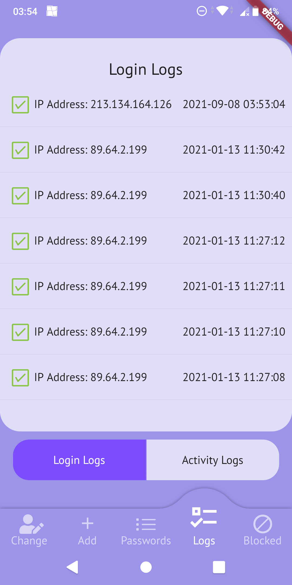
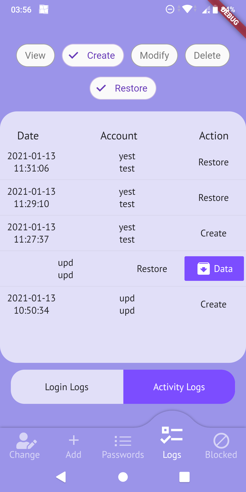
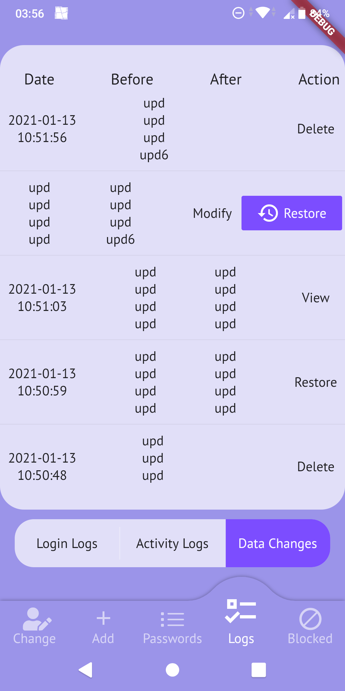

# Password Wallet

### A mobile application for managing passwords

The goal of this project is to create a mobile application for Android that allows users to store and manage their passwords in encrypted form.

The application supports HMAC and SHA-512 encryption algorithms. 
The application uses algorithm implementations provided by the [Pointy Castle package](https://pub.dev/packages/pointycastle), which is based on implementations from [the Bouncy Castle](https://bouncycastle.org/).

[BloC library](https://bloclibrary.dev/), by Felix Angelov, is used to manage application state.

Application code coverage is measured by LCOV and is 90.4%.

## Getting Started

These instructions will get you a copy of the project up and running on 
your local machine for development and testing purposes.

### Prerequisites

* Flutter SDK - https://flutter.dev/
* The Android emulator (requires setup in Android Studio) - https://developer.android.com/studio/

Detailed information about installation and configurations are provided at developers' site.

## Technology Stack

* Flutter
* SQLite

## Preview

<table>
    <tr>
        <td>
            
User Registration

            
        </td>
        <td>
            
Passwords Management

            
        </td>
        <td>
            
Adding Password

            
        </td>
    </tr>
    <tr>
        <td>
            
Changing User Password

            
        </td>
        <td>
            
Login Logs

            
        </td>
        <td>
            
Activity Logs

            
        </td>
    </tr>
    <tr>
        <td>
            
Data Changes

            
        </td>
    </tr>
</table>

## Author

* **Michał Koziara** 
